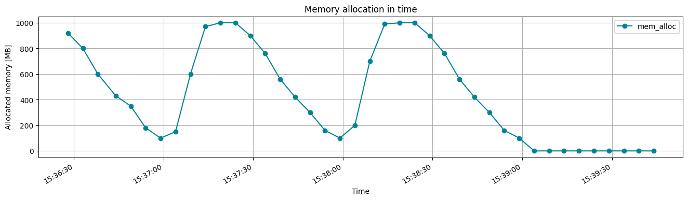
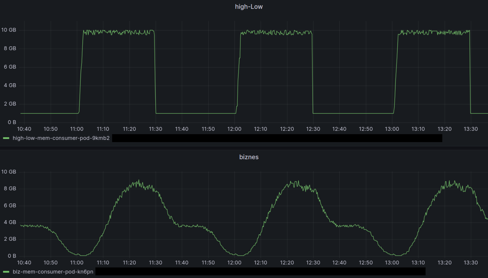

# ram_utilization
The project provides the `memory_consumer` python package together with example time-dependent characteristics of memory consumption collected in the [patterns](patterns) directory.

## Description
The `memory_consumer` app consumes memory according to the specified time characteristics (patterns).

### Application
The `memory_consumer` app is useful when there is a need to model a workload that consumes memory in a controlled way on a local machine, virtual machine or k8s cluster node.

### How it works
The app cyclically (within consecutive timeslots) reads an amount of memory to be allocated at the current timestamp (`REQUIRED_MEMORY`). The memory to be allocated is read from a specified pattern.  
Depending on the actual amount of allocated 
memory (`ACTUAL_MEMORY`):
- `if REQUIRED_MEMORY > ACTUAL_MEMORY`
  - the app allocates additional amount of memory (`REQUIRED_MEMORY - ACTUAL_MEMORY`) 
- `if REQUIRED_MEMORY < ACTUAL_MEMORY`
  - the app deallocates exceeding amount of memory (`ACTUAL_MEMORY - REQUIRED_MEMORY`)

By default, the app is running as an infinite loop, until the user stops it (CTRL+C).

## Usage

### Display help
The command displays the arguments for the app

```bash
python memory_consumer/start_mem_consumer.py -h
```
```
usage: start_mem_consumer.py [-h] -f PATTERN_FILE [-n NOISE_PERCENT] [-m MAX_RAM_MEGA] [-t TIME_SLOT_SEC]
                             [-s SLOPE_LINEAR_TREND] [-b] [-d DURATION_MIN]

Memory consumer

options:
options:
  -h, --help            show this help message and exit
  -f PATTERN_FILE, --pattern_file PATTERN_FILE
                        Csv file with a memory consumption pattern (time-stamped percent of maximal memory to be
                        allocated).
  -n NOISE_PERCENT, --noise_percent NOISE_PERCENT
                        Noise in percent introduced to the values in memory consumption pattern. Default=0, no noise.
  -m MAX_RAM_MEGA, --max_ram_mega MAX_RAM_MEGA
                        Memory allocated when the memory consumption pattern value is 100 (default: 1000). Memory
                        allocated for a pattern value = x is (x/100)*MAX_RAM_MEGA
  -t TIME_SLOT_SEC, --time_slot_sec TIME_SLOT_SEC
                        Period in seconds (default: 5), the memory consumption is changed.
  -s SLOPE_LINEAR_TREND, --slope_linear_trend SLOPE_LINEAR_TREND
                        A slope of the linear trend, that is added to the pattern values. Slope value is expressed
                        for the period of the memory consumption process. Default is 0.0
  -b, --start_from_beginning
                        Start from the beginning of the memory consumption pattern. If set, the memory consumption
                        will follow the pattern since its beginning no matter the time the app has started. If not
                        set (default), the memory consumption will follow the pattern since the time the app has
                        started.
  -d DURATION_SEC, --duration_sec DURATION_SEC
                        Execution time of the memory consumer app in seconds. Default=-1 - which means app is working
                        continuously until CTRL+C.
```
### Default usage
```bash
python memory_consumer/start_mem_consumer.py -f patterns/s/high_start_1mT.csv
```
In order to start the app, the path to file name containing a memory consumption pattern is required, e.g. ```-f patterns/s/high_start_1mT.csv```. The pattern used in the following example has a form of csv file [high_start_1mT.csv](patterns/s/high_start_1mT.csv). It is 60s long pattern, containing percents (`int`) of the maximum memory (default=1000MB) to be allocated at a given second.


More details about memory usage patterns can be found in the [Memory Consumption Patterns](#memory-consumption-patterns) section.

After start, the app logs to stdout:
- details on the memory consumption pattern:
```
MemPattern: patterns/s/high_start_1mT.csv, type=['s'], noise +/- 0%, smallest unit resolution=1s, pattern size=60 points, pattern duration (period)=60s
```
- details about the arguments of the `memory_consumer` app:
```
MemConsumer: maximum memory: 1000MB, allocation change interval: 5s, memory chunk size: 10MB, linear trend slope 0.0, start from pattern beginning: False, duration: infinite
```
- details about the initially allocated memory by the OS for the `memory_consumer` app:
```
MemConsumer: initial allocation: 30MB, correction rest: 0MB
```
- application start time:
```
Start time: 2023-10-02 11:57:26
```
Next, the app is logging to stdout its consecutive memory allocation events/steps:
```log
2023-10-02 11:57:26, Allocated 100% of 1000 MB, (in memory array) 1000 MB, (in process) 1000 MB for 5 sec
2023-10-02 11:57:31, Allocated 90% of 1000 MB, (in memory array) 900 MB, (in process) 900 MB for 5 sec
2023-10-02 11:57:36, Allocated 72% of 1000 MB, (in memory array) 720 MB, (in process) 720 MB for 5 sec
2023-10-02 11:57:41, Allocated 50% of 1000 MB, (in memory array) 500 MB, (in process) 500 MB for 5 sec
2023-10-02 11:57:46, Allocated 41% of 1000 MB, (in memory array) 410 MB, (in process) 410 MB for 5 sec
...
```
Every single log line reports the state after the memory allocation in each step:
- datetime of allocation step (`2023-10-02 11:57:26`)
- memory allocation percent of maximum memory (`Allocated 100% of 1000 MB`)
- memory allocated in the app's internal array (`(in memory array) 1000 MB`)
- memory allocated for the app process, read from OS level (`(in process) 1000 MB`)
- duration to the next allocation step (`for 5 sec`)

In each allocation step, every 5s (default value for argument `-t TIME_SLOT_SEC`), the app reads, from the memory consumption pattern file, the percent of maximum memory (default=1000MB) to be allocated at the current time. As the memory consumption pattern represents the percents in each second, the app first reads the percent value since its start time (`2023-10-02 11:57:26`) for the 26th second (100), next for the 31st (90), the 36th (72), the 41st (50), the 46th (41) and so on. As the pattern is 60s long, the memory consumption pattern is repeated for each consecutive minute. The effect of the memory allocation of 5-minute run of the `memory_consumer` can be seen below.


### Setting maximum memory
Setting the argument `--max_ram_mega 2000` or `-m 2000` allows to control the amount of memory allocated for `100%` pattern value. The default value is `1000MB`.

```bash
python memory_consumer/start_mem_consumer.py -f patterns/s/high_start_1mT.csv -m 2000
```
The effect of the memory allocation of 3-minute run of the `memory_consumer` with increased maximum memory (2000MB) can be seen below.


### Setting a timeslot between allocation steps
By default, the time between the consecutive memory allocation steps is `5s`. Setting the argument `--time-slot-sec 3` or `-t 3` allows to control the period between consecutive memory allocation steps (3s in this example).

```bash
python memory_consumer/start_mem_consumer.py -f patterns/s/high_start_1mT.csv -t 3
```
The effect of the memory allocation of 3-minute run of the `memory_consumer` with decreased `--time_slot_sec 3` (3s) can be seen below (more frequent allocation steps).


### Setting the app execution time 
By default, the app is running infinitely until a user stops it (CTRL+C). Setting the argument `--duration_sec 150` or `-d 150` allows to control the app's execution time (150s in this example).

```bash
python memory_consumer/start_mem_consumer.py -f patterns/s/high_start_1mT.csv -d 150
```
The effect of limited execution time can be seen in the figure below.



### Adding a noise to the memory consumption pattern 
By default, the app is allocating the percent of maximum memory according to the values from the memory consumption pattern. Setting the argument `--noise_percent 20` or `-n 20` allows for introducing some noise. If a pattern value is `90%` and `--noise_percent` is set to `20`, the app will uniformly random the final value within the scope `<72%:108%>`, `90%+-18% (20%*90%)`.

```bash
python memory_consumer/start_mem_consumer.py -f patterns/s/high_start_1mT.csv -n 20
```
The effect of adding `20%` noise to the pattern can be seen in the following figure.


### Adding a linear trend to the memory consumption pattern 
By default, the app allocates the percent of maximum memory according to the values from the memory consumption pattern. It is possible to apply a linear trend to those values, by defining a slope, i.e. setting the `--slope_linear_trend 0.1` or `-s 0.1` argument. As the duration of the example pattern lasts `60s`, the values will be increased by `10% (0.1)` every minute.

```bash
python memory_consumer/start_mem_consumer.py -f patterns/s/high_start_1mT.csv -s 0.1
```
The effect of applying the linear trend with slope `0.1` can be seen below.


### Start from the beginning of the pattern
The pattern used in all examples has a form of csv file [high_start_1mT.csv](patterns/s/high_start_1mT.csv) and is presented in the figure:

  

By default, the app starts allocating the memory using the pattern value corresponding to the start time of the app. For example, if the start time is 20:40:41, the first pattern value taken for memory allocation will be equal to 47% since that is the value corresponding to 41st second, as can be seen in the figure above (the app start time).

```bash
python memory_consumer/start_mem_consumer.py -f patterns/s/high_start_1mT.csv
```
```
MemPattern: patterns/s/high_start_1mT.csv, type=['s'], noise +/- 0%, smallest unit resolution=1s, pattern size=60 points, pattern duration (period)=60s
MemConsumer: maximum memory: 1000MB, allocation change interval: 5s, memory chunk size: 10MB, linear trend slope 0.0, start from pattern beginning: False, duration: 120s
MemConsumer: initial allocation: 30MB, correction rest: 0MB
Start time: 2023-10-02 20:40:41
2023-10-02 20:40:42, Allocated 47% of 1000 MB, (in memory array) 470 MB, (in process) 470 MB for 5 sec
2023-10-02 20:40:47, Allocated 40% of 1000 MB, (in memory array) 400 MB, (in process) 400 MB for 5 sec
2023-10-02 20:40:52, Allocated 25% of 1000 MB, (in memory array) 250 MB, (in process) 250 MB for 5 sec
```
The effect can be seen in the figure below:


However, it is possible to force the app to use the pattern values from the very beginning of the pattern, by setting the flag `--start_from_beginning` or `-b`. Then, no matter when the app starts, it will follow the memory consumption pattern from its beginning.

```bash
python memory_consumer/start_mem_consumer.py -f patterns/s/high_start_1mT.csv -b
```
The effect of `-b` flag set can be seen in the figure below:


## Memory consumption patterns
Time characteristics of memory consumption (also called patterns) contain the percent of maximum memory for specific days of week (`d`), hours (`h`), minutes (`m`) and seconds (`s`). The first columns in the csv file indicate specific time markers `d`, `h`, `m` or `s`. The last column `mem` contains the percent of memory to be allocated. However, not all markers must be present within the pattern. It all depends on how long the memory consumption pattern you want to model.

### dhm-pattern format
The format of a csv file containing 1-week pattern with time resolution of 1-minute should be as follows:
```csv
d,h,m,mem
0,0,0,28
0,0,1,26
0,0,2,25
0,0,3,24
0,0,4,23
0,0,5,22
...
6,23,59,66
```
 
The last time marker (`m` in this example) can have different time resolution, as compared to the standard approach, 
for instance 5-minute. The format of a csv file containing such a pattern should be as follows:

```csv
d,h,m,mem
0,0,0,28
0,0,5,26
0,0,10,25
0,0,15,24
0,0,20,23
...
0,0,55,22
...
6,23,55,66
```
For example, the running `memory_consumer` app doing a memory allocation on Monday (`d=0`) at `00:18 (%H:%M)` will use the memory allocation percent value equal to `24` according to the row `0,0,15,24` (the last value before the time of allocation). Example dhm-patterns with time resolution of 5-minute can be found in the [patterns/dhm](patterns/dhm) directory. 

### ms-pattern format
The format of a csv file containing 1-hour pattern with time resolution of 1-second should be as follows:
```csv
m,s,mem
0,0,10
0,1,12
0,2,18
...
0,59,23
1,0,25
...
59,59,56
```
As you can see, there are time markers only for minutes (`m`) and seconds (`s`) present here. The format of a csv file containing 1-hour pattern with time resolution of 30 s should be as follows:

```csv
m,s,mem
0,0,10
0,30,100
1,0,100
1,30,100
2,0,100
2,30,100
3,0,100
...
57,0,10
57,30,10
58,0,10
58,30,10
59,0,10
59,30,10
```
Example ms-patterns with the time resolution of 30s can be found in the [patterns/ms](patterns/ms) directory.

### Example patterns
In the [patterns](patterns) directory there are some ready to use memory consumption patterns.  

- [patterns/dhm](patterns/dhm) - weekly patterns, time resolution: 5 minutes
- [patterns/m](patterns/m) - 1-hour patterns, time resolution: 1 minute
- [patterns/ms](patterns/ms) - 1-hour patterns, time resolution: 30 seconds
- [patterns/s](patterns/s) - 1-minute patterns, time resolution: 1 second


## Installation
Use the [pip](https://pip.pypa.io/en/stable/) package manager to install the package locally.

```bash
pip install .
```

## Supporting make commands
In order to run tests of the app, use: 

```bash
make test
```
In order to show help, use:

```bash
make run-help
```
In order to run the app for an example pattern, use:

```bash
make run
```
In order to build the app docker image, use:

```bash
make docker-build
```

In order to build the app docker image (`memory_consumer:version`) and run as docker container, use:

```bash
make docker-run
```

## Start the app as docker container

```bash
docker run -it --rm memory_consumer:2.0.0 -f patterns/s/high_low_10s.csv -n 10 -m 2000 -t 3 -s 0.1 -b -d 60
```

## Kubernetes Pod manifest
```yaml
apiVersion: v1
kind: Pod
metadata:
    generateName: high-low-pod-
    labels:
      app: mem-consumer
      type: high-low
spec:
    containers:
    - name: mem-consumer-container
      image: <image-repository/image-name:image-version>
      args: ["-f", "patterns/ms/high_low.csv", "-n", "10", "-m", "1000", "-t", "5"]
      resources:
        requests:
          memory: "100Mi"
          cpu: "100m"
    imagePullSecrets:
      - name: <secrets with credentials to image-repository>
```

## Kubernetes Deployment manifest
```yaml
apiVersion: apps/v1
kind: Deployment
metadata:
    name: ms-biz-dep
    labels:
      app: mem-consumer
      type: ms-biz
spec:
  replicas: 1
  selector:
    matchLabels:
      type: ms-biz
  template:
    metadata:
      name: mem-consumer-pod
      labels:
        app: mem-consumer
        type: ms-biz
    spec:
      containers:
      - name: mem-consumer-container
        image: <image-repository/image-name:image-version>
        args: ["-f", "patterns/ms/biz.csv", "-n", "10", "-m", "1000", "-t", "5"]
        resources:
          requests:
            memory: "100Mi"
            cpu: "100m"
      imagePullSecrets:
        - name: <secrets with credentials to image-repository>
```
## Example measurements on Kubernetes cluster
Below measured memory consumption for k8s Pods running `memory_consumer` apps for two different patterns are presented.
The measurements have been collected using the Prometheus framework.   



## Support
No support at the moment.

## Roadmap
No roadmap at the moment.

## Authors and acknowledgment
The author of this code is Tomasz Janaszka (tomasz.janaszka@codilime.com), CodiLime (codilime.com).

## License
[MIT](LICENSE)

## Known issues
The code is written in Python and memory de-allocation depends on the garbage collection process. When running the app locally, especially for short `TIME_SLOT_SEC (<3s)`, problems with memory de-allocation may be observed from time to time. When the app was run as a Pod in Kubernetes cluster with `TIME_SLOT_SEC (>=5s)` such a behavior was not observed.
